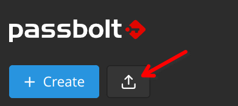
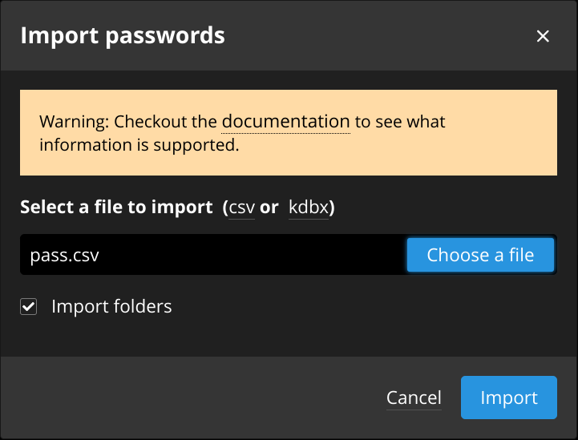

# qip-pass-export

Script to export passwords from pass / password-store / the standard unix password manager.
The exported passwords can be imported into Passbolt.

Is is very likely they can also be imported into other password managers like Bitwarden, Vaultwarden and more, but I have not tested this myself.

## Background

I love [pass](https://www.passwordstore.org/) but it doesn't get much approval from the low-tech members of my family because of the complex software setup, hokey browser integration and needing to manually maintain GPG keys.

I decided to move all our passwords to a self-hosted [Passbolt Pro](https://www.passbolt.com/pricing/pro) instance.

To help with the migration, I made this simple `pass2csv` script in Python to export all my "pass" passwords to a CSV file that can be imported directly into Passbolt.

In particular the output format is supposedly Bitwarden's own format. See "Csv (BitWarden)" from [How to import passwords in passbolt](https://help.passbolt.com/faq/start/import-passwords)

> [!NOTE]
> This script can only decrypt password files for which you are the intended recipient, e.g., you posess the corresponding GPG private keys.
> This is NOT a brute-force decrypter, you must *own* the data.

## Installation from source

Minimum requirements:

- Python 3.x (tested with 3.11)

### Get the source

Clone the repository:

```sh
git clone https://github.com/qualIP/qip-pass-export.git
```

### Python virtual environment

Ideally, you create or activate a Python virtual environment.

I recommend creating a Python virtual environment just for this tool so, when you are done, you can just remove the whole `qip-pass-export` directory and that will leave nothing behind to cleanup.

Otherwise, it is recommended to create a simple Python virtual environment, preferably under the qip-pass-export directory itself:

```sh
python3 -m venv qip-pass-export/venv
source qip-pass-export/venv/bin/activate
pip install --upgrade pip
```

You may need to install your distributions Python venv module, e.g, the `python3-venv` package.

### Install the qip-pass-export package

```sh
pip install ./qip-pass-export
```

Make sure to include the above `./` to tell pip this is a directory, not a package name.

## Usage

### Exporting `pass` passwords

Usage is simple, just provide paths to pass `.gpg` files and it will output a CSV file on its standard output which you can pipe to a file of your choice.
Typically, pass stores your password files under the `~/.password-store` directory.

Example: Export top-level passwords

```sh
pass2csv ~/.password-store/*.gpg > pass.csv
```

Example: Export passwords from a sub-directory

```sh
pass2csv ~/.password-store/sub-directory/*.gpg > pass.csv
```

Example: Export all passwords at once

```sh
find ~/.password-store -name '*.gpg' -print0 | xargs -r0 pass2csv > pass.csv
```

Please be patient, it takes a while to decrypt each individual file.

> [!CAUTION]
> The exported CSV file contains **plain text**, **unencrypted passwords**.
> Once you no longer needed the CSV file, delete it and empty your trash before someone else gets a hold of it.
> Better yet, use a tool like [wipe](https://github.com/berke/wipe) to perform a secure erase.

### Import passwords into Passbolt

Next, go to your Passbolt Web interface, and click on the Import button:



In the Import dialog, select your CSV file.
If you wish to preserve the original directory structure, make sure to check the "Import folders" checkbox.



Hit "Import", you're done.

> [!CAUTION]
> Remember to securely erase the CSV file!

## Future work

Now that I'm done migrating my passwords to Passbolt, I don't foresee making any change of consequence to this software.

With proper incentives :moneybag::coffee:, I may be inclined to export various other formats -- Let me know.

If you're having issues using this software, please let me know by [opening an issue](https://github.com/qualIP/qip-pass-export/issues) in GitHub.
